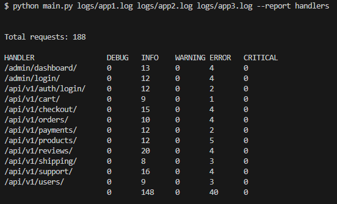
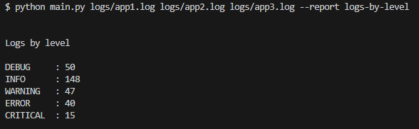
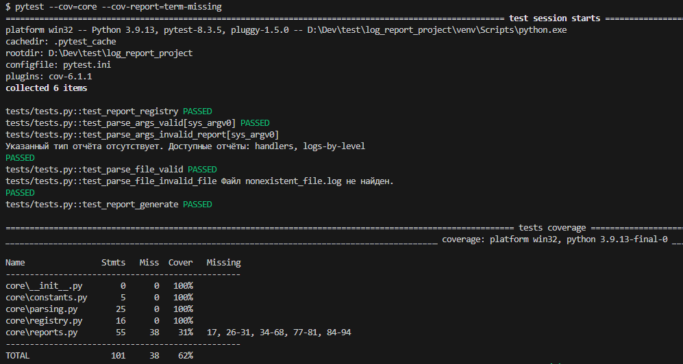

# Log Report Project

## Описание

Этот проект представляет собой реализацию CLI приложения для формирования отчета из лог файлов. 
  
  
Ниже представлен отчет о состоянии ручек API по каждому уровню логирования для <kbd>django.requests</kbd>.
# 

В архитектуру приложения заложена возможность удобного добавления новых отчетов.
Для этого необходимо добавить новый класс отчета в файле <kbd>core/reports.py</kbd>, в котором должно быть описано название отчета, шаблон для парсинга логов и метод генерации формы (ниже пример отчета об общем количестве логов по каждому уровню логирования).
# 

Весь функционал проекта покрыт тестами, за исключением метода генерации формы отчета, так как он является уникальным в каждом конкретном случае.
# 

## Контакты

Артем Максимов - [@ovienrait](https://t.me/ovienrait) - [nirendsound@gmail.com](https://nirendsound@gmail.com)

Ссылка на проект: [Log Report Project](https://github.com/ovienrait/log_report_project.git)